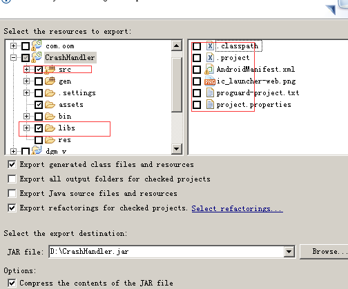

# 项目名及简介
* 主要是监控android的crash信息，并发一个http请求到我的[自动化app测试框架](https://github.com/284772894/appiumn_auto)

# 用法


## 打包jar



## 其他app引用
* AndroidManifest加权限

```
<uses-permission android:name="android.permission.WRITE_EXTERNAL_STORAGE"/>
<uses-permission android:name="android.permission.ACCESS_WIFI_STATE"/>
<uses-permission android:name="android.permission.INTERNET"></uses-permission>
```

* AndroidManifest设置application的值

```
<application android:allowBackup="true" 
      android:icon="@drawable/ic_launcher" 
      android:label="@string/app_name" 
      android:name=".CrashApplication">
```

* 需要在自己的application引用

```
import android.app.Application;
import com.shikun.crashhandler.*;  #引用打包的jar
public class CrashApplication extends Application  {
    @Override  
    public void onCreate() { 
     super.onCreate();  
     CrashHandler mCrashHandler = CrashHandler.getInstance();  
     mCrashHandler.setCustomCrashHanler(getApplicationContext()); 
    }
}
```

# 日志分析
* 自己随便制造一个闪退运行程序，你会发现一句很友好的“很抱歉，程序遭遇异常，即将退出”代替了冷冰冰的警告框
* 我们打开DDMS，在mnt/sdcard/Crash/目录下面发现了有一个文件，打开文件，我们可以看到

```
versionCode = 1  
PRODUCT = sdk  
MODEL = sdk  
versionName = 1.0  
SDK_INT = 8  
java.lang.RuntimeException: Unable to start activity ComponentInfo{com.example.customcrash/com.example.customcrash.MainActivity}: java.lang.NullPointerException  
  at android.app.ActivityThread.performLaunchActivity(ActivityThread.java:2663)  
  at android.app.ActivityThread.handleLaunchActivity(ActivityThread.java:2679)  
  at android.app.ActivityThread.access$2300(ActivityThread.java:125)  
  at android.app.ActivityThread$H.handleMessage(ActivityThread.java:2033)  
  at android.os.Handler.dispatchMessage(Handler.java:99)  
  at android.os.Looper.loop(Looper.java:123)  
  at android.app.ActivityThread.main(ActivityThread.java:4627)  
  at java.lang.reflect.Method.invokeNative(Native Method)  
  at java.lang.reflect.Method.invoke(Method.java:521)  
  at com.android.internal.os.ZygoteInit$MethodAndArgsCaller.run(ZygoteInit.java:868)  
  at com.android.internal.os.ZygoteInit.main(ZygoteInit.java:626)  
  at dalvik.system.NativeStart.main(Native Method)  
Caused by: java.lang.NullPointerException  
  at com.example.customcrash.MainActivity.onCreate(MainActivity.java:15)  
  at android.app.Instrumentation.callActivityOnCreate(Instrumentation.java:1047)  
  at android.app.ActivityThread.performLaunchActivity(ActivityThread.java:2627)  
  ... 11 more
```


